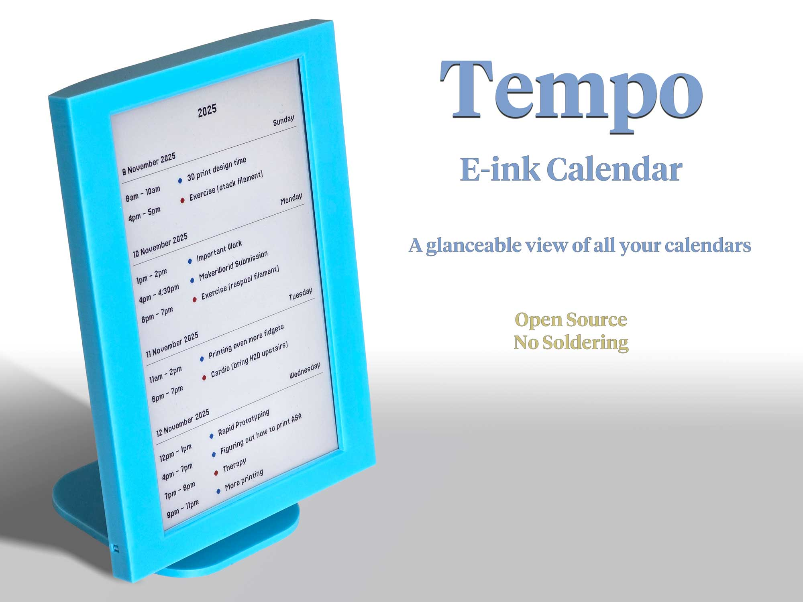

# Tempo E-ink Calendar

## About Tempo 

Tempo displays your Google Calendar feed on an e-ink screen that updates automatically throughout the day. It can also display feeds from other popular online calendars like Outlook (i.e., any web-based calendar tool that provides a standard .ics feed).

- Assemble in seconds
- No wiring or soldering!
- Open source

Tempo is not only super useful in daily life, but it is also an ideal project for learning to combine 3D printing with Raspberry Pi and e-ink screens. It uses off-the-shelf parts, and it's simple to set up.

## Required Hardware 
- Raspberry Pi Zero 2 W (with pre-soldered headers)
- MicroSD Card (8GB or larger)
- Inky Impression 7" (2025) E-Ink Display by Pimoroni
- 3D-Printed Case and Stand (on MakerWorld)

## Installation

See ./docs/installation.md for detailed installation instructions.

## License

Distributed under the GPL 3.0 License, see [LICENSE](./LICENSE) for more information.

This project includes fonts and icons with separate licensing and attribution requirements. See [Attribution](./docs/attribution.md) for details.

### Thanks & Acknowledgements

This repo is built on top of [InkyPi](https://github.com/fatihak/InkyPi). It has been significantly modified
and reworked for a different use case and the calendar code rewritten, but I want to 
fully acknowledge the work of [fatihak](https://github.com/fatihak) and the open source InkyPi project on top 
of which this was built.

If you are an advanced user who wants more features beyond a calendar, check out the original 
[InkyPi project](https://github.com/fatihak/InkyPi). It will run on the same hardware.

If you want to donate anything to this project, just donate instead to [InkyPi](https://github.com/fatihak/InkyPi)
or his Patreon.